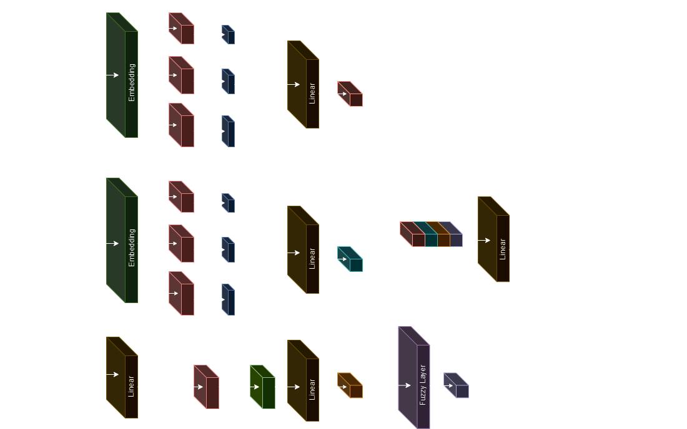

# Fuzzy Deep Hybrid Network for Fake News Detection

This repository contains the resources of our paper: "[Fuzzy Deep Hybrid Network for Fake News Detection](https://doi.org/10.1145/3628797.3628971)". The resources include the complete code for each sub-model used in the paper, and the record of their outputs.


## Models

<p align="center"></p>

The FDHN model utilises a tripartite input structure comprising three distinct channels: a news text channel that contains the news article’s written content, a textual context channel that includes any accompanying textual context information, and a numerical context channel that captures any relevant numerical data about the news article. The structure of the model is depicted in detail in figure above.

In this model, there are four basic components: TextCNN ($TC$), BERT ($BT$), CNNBiLSTM ($CB$) and Fuzzy ($FZ$).

Three types of models are considered: (i) models with only ($TC$) or ($TC+FZ$) for news text data, (ii) models with multiple components ($BT, TC, CB$) and their fuzzy counterpart ($BT+TC+CB+FZ$), (iii) models with multiple components ($TC, TC, CB$) and their fuzzy counterpart ($TC+TC+CB+FZ$). All the code and record are at [`./model`](https://github.com/chengxuphd/FDHN/tree/main/model)


## Quick Start

1.  Clone and download this repository.

2.  Install the required packages.

    ```bash
    pip install -r requirements.txt
    ```

3. Download [LIAR dataset](https://www.cs.ucsb.edu/~william/data/liar_dataset.zip), and unzip.

4.  For all model training, simply specify `worksapce` as the path to the LIAR dataset and `model_save` as the path to save the model weights file to run.  


## Citation

If you find our work useful in your research, please consider citing:

```bibtex
@inproceedings{xu2023fuzzy,
   author = {Xu, Cheng and Kechadi, M-Tahar},
   title = {Fuzzy Deep Hybrid Network for Fake News Detection},
   year = {2023},
   isbn = {9798400708916},
   publisher = {Association for Computing Machinery},
   address = {New York, NY, USA},
   url = {https://doi.org/10.1145/3628797.3628971},
   doi = {10.1145/3628797.3628971},
   booktitle = {Proceedings of the 12th International Symposium on Information and Communication Technology},
   pages = {118–125},
   numpages = {8},
   keywords = {Classification Systems, Deep Learning, Hybrid Learning Models, Fuzzy Deep Learning, Fake News Detection},
   location = {<conf-loc>, <city>Ho Chi Minh</city>, <country>Vietnam</country>, </conf-loc>},
   series = {SOICT '23}
}
```

```bibtex
@article{xu2024enhanced,
  author={Xu, Cheng and Kechadi, M-Tahar},
  journal={IEEE Access}, 
  title={An Enhanced Fake News Detection System With Fuzzy Deep Learning}, 
  year={2024},
  volume={12},
  number={},
  pages={88006-88021},
  keywords={Fake news;Fuzzy logic;Benchmark testing;Social networking (online);Deep learning;Task analysis;Natural language processing;Classification algorithms;Deep learning;fuzzy deep learning;fake news;fake news detection;fact-checking;NLP;classification systems;benchmark},
  doi={10.1109/ACCESS.2024.3418340}}
```
